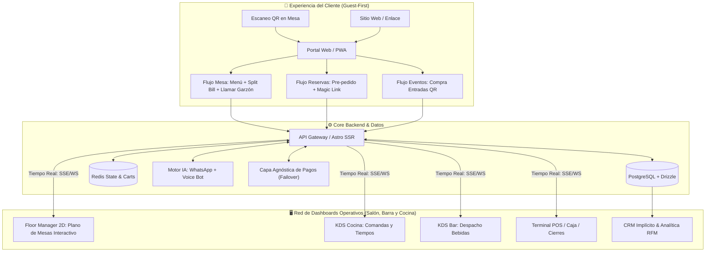
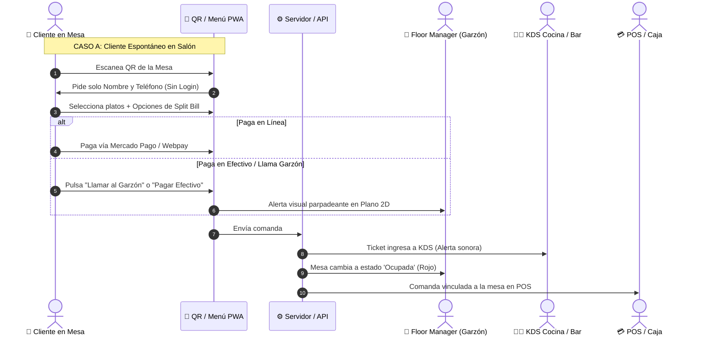
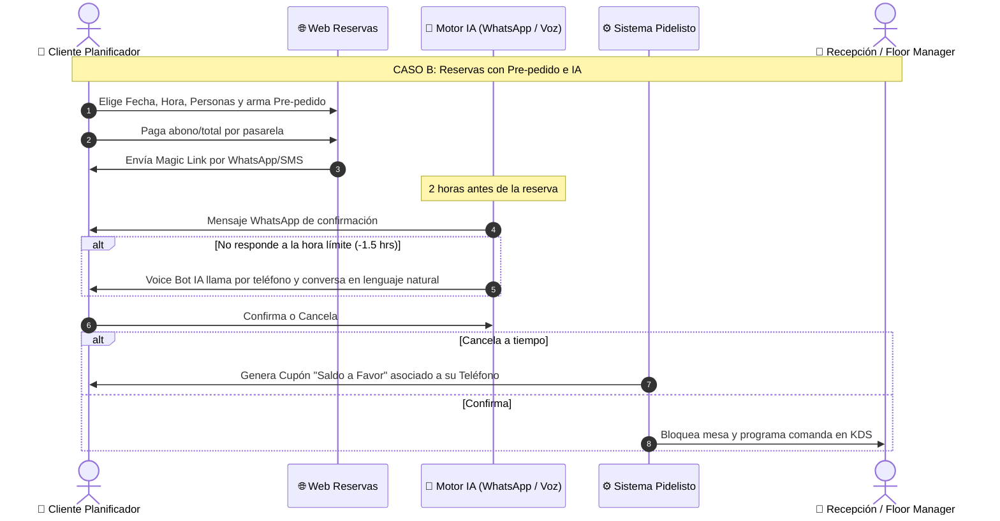
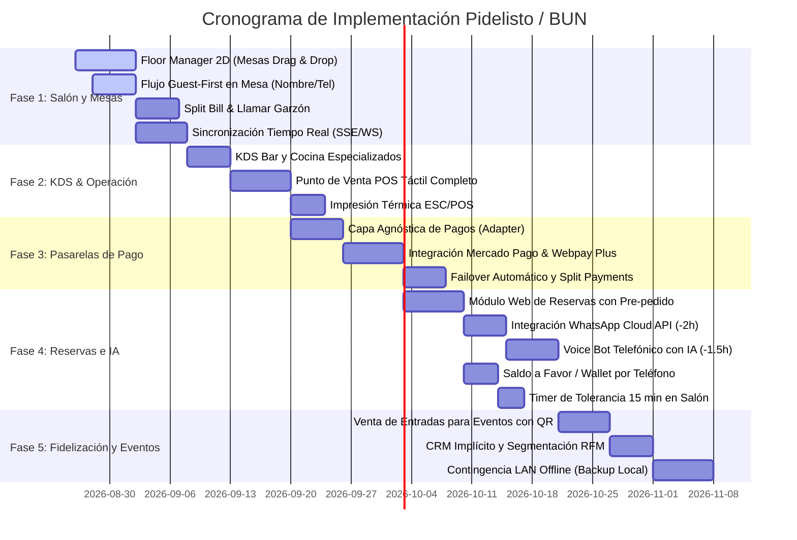

# 🗺️ Hoja de Ruta (Roadmap) - Ecosistema BUN / PIDELISTO.CL

> **Sistema Híbrido de Gestión Gastronómica, Autoatención "Guest-First", KDS en Tiempo Real y Confirmación de Reservas con Inteligencia Artificial.**

---

## 📌 1. Ficha Técnica y Visión del Proyecto

* **Nombre del Producto:** PIDELISTO.CL / BUN Platform
* **Filosofía Principal:** **"Guest-First"** (Cero fricción: los clientes acceden, piden, dividen la cuenta y reservan sin registrar cuentas ni contraseñas).
* **Fase Actual:** **Construcción Avanzada** (Estructura Multi-Tenant, Drizzle ORM + PostgreSQL, KDS Base, POS Base y Menú Público operativos).
* **Stack Tecnológico:**
  * **Frontend:** Astro 5 SSR + React 19 + TailwindCSS + Lucide Icons.
  * **Backend & Datos:** Node.js (Astro API Endpoints) + PostgreSQL + Drizzle ORM + Redis (en vivo).
  * **Tiempo Real:** Server-Sent Events (SSE) / WebSockets para sincronización en milisegundos.
  * **Comunicaciones & IA:** WhatsApp Cloud API (Meta) + Voice Bots con IA (Vapi.ai / Bland.ai).
  * **Pasarelas de Pago:** Capa agnóstica multi-proveedor (Mercado Pago, Webpay Plus Transbank, Stripe).
  * **Despliegue:** Vercel (Staging) y VPS Coolify (Producción Docker Multi-stage).

---

## 🏗️ 2. Arquitectura Global del Ecosistema

---

## 👥 3. Flujos de Usuario Principales (Casos de Uso)

---

## 📦 4. Detalle Exhaustivo de Módulos y Funcionalidades

### 📱 MÓDULO 1: Portal Cliente (PWA Guest-First & Autoatención)
*Diseñado para eliminar fricciones y agilizar la rotación de mesas mediante autoservicio móvil.*

| Funcionalidad | Descripción Detallada | Estado | Ruta / Enlace |
| :--- | :--- | :---: | :--- |
| **Menú Digital Interactivo** | Catálogo dinámico con fotos, categorías (Comida, Bar, Promos), modificadores (extras, salsas), variantes y control de stock en tiempo real. | ✅ **Listo** | [`/menu/burger-craft`](http://localhost:4321/menu/burger-craft) |
| **Sesión de Mesa Guest-First** | Ingreso al menú vinculando número de mesa escaneada. Solicita únicamente **Nombre y Teléfono** (sin contraseñas) creando una sesión temporal. | 🔄 **En Progreso** | [`/menu/[slug]?table=X`](http://localhost:4321/menu/burger-craft) |
| **División de Cuenta (Split Bill)** | Permite a varios comensales en la misma mesa pagar sus propios productos de forma independiente o dividir el total en partes iguales desde sus propios teléfonos. | 🔄 **En Progreso** | En Menú PWA |
| **Botones de Asistencia en Mesa** | Botones de acción directa: **"Llamar al Garzón"** (para consultas) y **"Pagar en Efectivo / POS Físico"**, disparando alertas visuales inmediatas en salón. | 🔄 **En Progreso** | En Menú PWA |
| **Venta de Entradas para Eventos** | Módulo de ticketing para eventos y shows: selección de fecha, compra de entradas con QR dinámico por email/WhatsApp y lector para control de aforo en puerta. | 📋 **Planificado** | [`/admin/events`](http://localhost:4321/admin) |
| **Modo Carta Informativa (Solo Lectura)** | Modo de visualización estática para clientes que solo desean ver precios y platos sin interactuar con el carrito (`?type=read`). | ✅ **Listo** | [`/menu/burger-craft?type=read`](http://localhost:4321/menu/burger-craft?type=read) |

---

### 🤖 MÓDULO 2: Motor de Reservas, Pre-pedidos & Confirmación IA
*Sistema inteligente para maximizar la ocupación del local y erradicar el ausentismo (No-Show).*

| Funcionalidad | Descripción Detallada | Estado | Ruta / Enlace |
| :--- | :--- | :---: | :--- |
| **Reservas Web con Pre-pedido** | Widget para reservar fecha, hora y comensales con la opción de armar el pedido de comida/bebida por adelantado, pagando un abono o el total. | 📋 **Planificado** | [`/reservations`](http://localhost:4321) |
| **Magic Link de Reserva** | Generación de enlace seguro enviado por WhatsApp/SMS con el detalle, estado y acceso para modificar o cancelar la reserva sin requerir usuario/clave. | 📋 **Planificado** | Servicio `lib/magic-links` |
| **Recordatorio WhatsApp (-2 hrs)** | Envío automático de mensaje interactivo por Meta WhatsApp Cloud API pidiendo confirmación con botones (Confirmar / Cancelar). | 📋 **Planificado** | Worker / Cron Job |
| **Voice Bot IA Telefónico (-1.5 hrs)** | Si no hay confirmación digital a la hora límite, un agente de voz con IA (Vapi.ai / Bland.ai) llama al cliente y conversa en lenguaje natural para confirmar o reprogramar. | 📋 **Planificado** | Webhook `/api/webhooks/voice-bot` |
| **Política Flex / Saldo a Favor** | Si el cliente cancela antes del límite, el pago no se devuelve bancariamente, sino que se transforma automáticamente en un **Cupón / Saldo a Favor** asociado a su teléfono. | 📋 **Planificado** | [`/admin/marketing`](http://localhost:4321/admin) |
| **Tolerancia en Salón (15 min)** | Contador regresivo visual en el mapa de mesas al llegar la hora de la reserva. Si se vence el tiempo, la mesa se libera y se frena la comanda en cocina. | 📋 **Planificado** | En Floor Manager |

---

### 🖥️ MÓDULO 3: Red de Dashboards Operativos en Tiempo Real
*Interfaces táctiles sincronizadas para optimizar la velocidad del servicio en salón, barra y cocina.*

| Funcionalidad | Descripción Detallada | Estado | Ruta / Enlace |
| :--- | :--- | :---: | :--- |
| **Floor Manager 2D (Plano de Mesas)** | Vista gráfica 2D con *Drag & Drop* para organizar mesas, asignar garzones y visualizar estados por color: **Verde** (Libre), **Rojo** (Ocupada), **Parpadeante** (Llama garzón), **Amarillo** (Tolerancia). | 🔄 **En Progreso** | [`/admin/floor`](http://localhost:4321/admin/floor) |
| **KDS Cocina (Pantalla de Comandas)** | Pantalla táctil para cocineros: comandas ordenadas por antigüedad, semáforo de retrasos (+15 min en rojo), etapas de preparación y priorización de pre-pedidos. | ✅ **Listo (Base)** | [`/admin/kitchen`](http://localhost:4321/admin/kitchen) |
| **KDS Bar (Despacho de Bebidas)** | Pantalla especializada para barra que filtra automáticamente solo productos de coctelería y bebidas para despachos ultrarrápidos. | 🔄 **En Progreso** | [`/admin/kitchen?station=bar`](http://localhost:4321/admin/kitchen) |
| **Punto de Venta POS (`/admin/pos`)** | Terminal táctil de caja para toma de pedidos presenciales, cobro en mostrador, asignación de mesas y facturación. | 🔄 **En Progreso** | [`/admin/pos`](http://localhost:4321/admin/pos) |
| **Caja y Cierres de Turno (`/admin/cashier`)** | Módulo para apertura/cierre de caja, arqueo de dinero en efectivo, balance de tarjetas y registro de egresos. | ✅ **Listo (Base)** | [`/admin/cashier`](http://localhost:4321/admin/cashier) |
| **Sincronización en Tiempo Real** | Conexión bidireccional mediante SSE / WebSockets para que las órdenes de los clientes impacten al instante en KDS, POS y Floor Manager sin refrescar. | 🔄 **En Progreso** | Endpoint `/api/realtime` |
| **Impresión Térmica ESC/POS** | Módulo de conexión e impresión física de comandas en impresoras de 58mm y 80mm en cocina, barra y recibos de caja. | 📋 **Planificado** | [`/admin/printers`](http://localhost:4321/admin/printers) |

---

### 💳 MÓDULO 4: Motor Transaccional de Pagos Agnósticos
*Infraestructura de pagos resiliente con múltiples procesadores y alta disponibilidad.*

| Funcionalidad | Descripción Detallada | Estado | Ruta / Enlace |
| :--- | :--- | :---: | :--- |
| **Capa Agnóstica de Pagos (Adapter Pattern)** | Arquitectura desacoplada que permite procesar pagos a través de múltiples pasarelas mediante una interfaz unificada (`PaymentGateway`). | 📋 **Planificado** | `src/lib/payments/*` |
| **Integración Mercado Pago** | Cobro con Checkout Pro, QR dinámico y tarjetas de crédito/débito en Chile y Latinoamérica. | 📋 **Planificado** | Adaptador Mercado Pago |
| **Integración Webpay Plus (Transbank)** | Pasarela oficial para pagos con tarjetas bancarias y Redcompra en Chile. | 📋 **Planificado** | Adaptador Transbank |
| **Integración Stripe** | Cobros internacionales multidivisa para turistas y reservas extranjeras. | 📋 **Planificado** | Adaptador Stripe |
| **Failover Automático** | Conmutación inteligente: si una pasarela reporta caídas o rechazos recurrentes, el sistema desvía los cobros automáticamente a la pasarela de respaldo. | 📋 **Planificado** | Orquestador de Pagos |
| **Pagos Fraccionados (Split Payments)** | Lógica transaccional para liquidar comandas con múltiples tarjetas o combinación de métodos de pago (ej. Mitad Webpay, mitad Efectivo). | 📋 **Planificado** | En POS y Checkout |

---

### 📊 MÓDULO 5: CRM Implícito, Fidelización & Analítica
*Inteligencia de negocio automatizada sin necesidad de formularios invasivos para el comensal.*

| Funcionalidad | Descripción Detallada | Estado | Ruta / Enlace |
| :--- | :--- | :---: | :--- |
| **Identificación por Anclas** | Construcción automática del perfil de consumo del cliente vinculando su número de teléfono y Device Fingerprint a su historial de comandas. | 📋 **Planificado** | Modelo `customers` |
| **Analítica de Rotación de Mesas** | Métricas del tiempo promedio desde que el cliente se sienta, ordena, come y desocupa la mesa. | 📋 **Planificado** | [`/admin/reports`](http://localhost:4321/admin/reports) |
| **Tiempos de Cocina y Despacho** | Medición exacta de tiempos de preparación por estación (Plancha, Frituras, Bar) detectando cuellos de botella con `prep_events`. | ✅ **Listo (Base)** | [`/admin/reports`](http://localhost:4321/admin/reports) |
| **Segmentación RFM (Recencia, Frecuencia, Monto)** | Clasificación de clientes (VIP, Frecuentes, En Riesgo, Perdidos) para campañas automáticas de re-activación. | 📋 **Planificado** | [`/admin/marketing`](http://localhost:4321/admin) |
| **Matriz BCG de Productos** | Clasificación de platos y bebidas según volumen de ventas y margen de rentabilidad (Estrella, Vaca, Incógnita, Perro). | 📋 **Planificado** | [`/admin/reports`](http://localhost:4321/admin/reports) |

---

### ⚙️ MÓDULO 6: Gestión SaaS, Configuración & Operación
*Módulos administrativos para la gestión de locales, personal y personalización de marca.*

| Funcionalidad | Descripción Detallada | Estado | Ruta / Enlace |
| :--- | :--- | :---: | :--- |
| **Generador de Enlaces y Códigos QR** | Generador de QR dinámicos para mesas (1 a 20), QR de barra y QR general con descarga SVG y PNG. | ✅ **Listo** | [`/admin/qr`](http://localhost:4321/admin/qr) |
| **Guía de Onboarding 17 Pasos** | Asistente de configuración guiada para nuevos restaurantes con barra de progreso y widget 🚀 en Sidebar. | ✅ **Listo** | [`/admin/onboarding`](http://localhost:4321/admin/onboarding) |
| **Gestión de Roles y Equipo** | Creación y permisos de personal (Administrador, Mesero, Cajero, Cocinero, Repartidor). | ✅ **Listo** | [`/admin/team`](http://localhost:4321/admin/team) |
| **Configuración de Canales y Servicios** | Habilitación de Delivery, Para Llevar, Consumo en Local, Cobro de Propinas y Zonas de Cobertura. | ✅ **Listo** | [`/admin/settings`](http://localhost:4321/admin/settings) |
| **Personalización de Marca (Branding)** | Logotipo, banner de portada, paletas de colores, moneda e información de contacto del restaurante. | ✅ **Listo** | [`/admin/business`](http://localhost:4321/admin/business) |
| **Matriz de Planes SaaS y Precios** | Página de precios comparativa entre planes (Free, Starter, Pro) con tooltips explicativos. | ✅ **Listo** | [`/pricing`](http://localhost:4321/pricing) |
| **Modo Contingencia Offline (LAN Backup)** | Servidor local de respaldo para que la operación interna (KDS, Caja, Floor Manager) continúe funcionando si cae el proveedor de internet. | 📋 **Planificado** | Módulo de Red Local |

---

## 🚀 5. Cronograma de Fases de Desarrollo

---

## 🎯 6. Backlog Inmediato (Próximas Tareas de Código)

1. 🟢 **Tarea 1 - Floor Manager 2D (`/admin/floor`):**
   * Crear el canvas interactivo con drag & drop de mesas.
   * Representación visual de estados: Libre (Verde), Ocupada (Rojo), Llamando Garzón (Parpadeo) y Reserva (Amarillo).
   * Asignación rápida de garzones por zona.

2. 🟢 **Tarea 2 - Flujo Mesa Guest-First (`/menu/[slug]?table=X`):**
   * Modal de bienvenida ligero que pide Nombre y Teléfono.
   * Selector para pagar individualmente o dividir la cuenta (*Split Bill*).
   * Botón interactivo de "Llamar al Garzón" con confirmación en pantalla.

3. 🟢 **Tarea 3 - Capa de Conectividad en Tiempo Real:**
   * Crear el endpoint SSE (`/api/realtime/events`) para despachar eventos de nuevas comandas, cambios de estado en cocina y llamados de asistencia.
   * Conectar `PosDisplayIsland`, `KitchenDisplayIsland` y `FloorManagerIsland` a la fuente de eventos.
